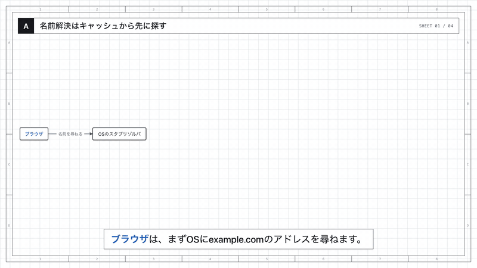
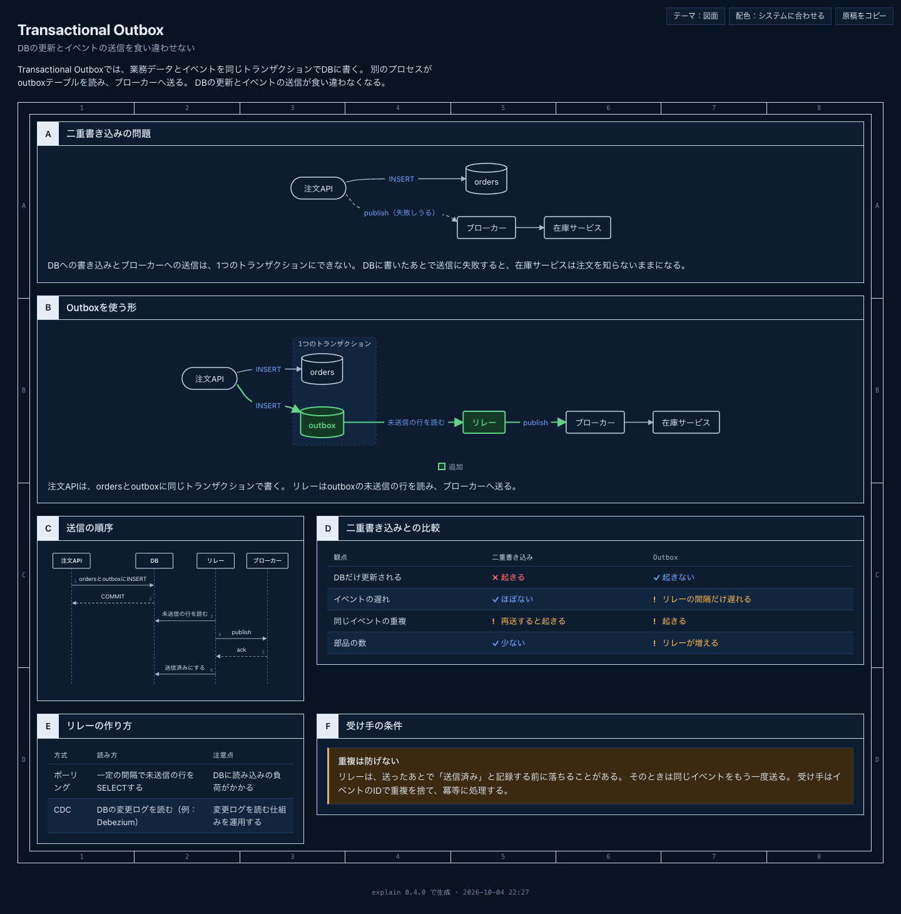
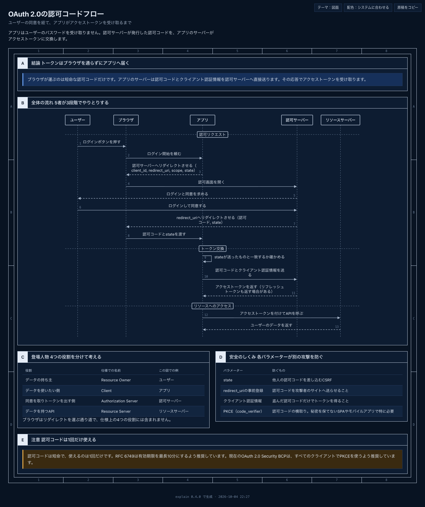
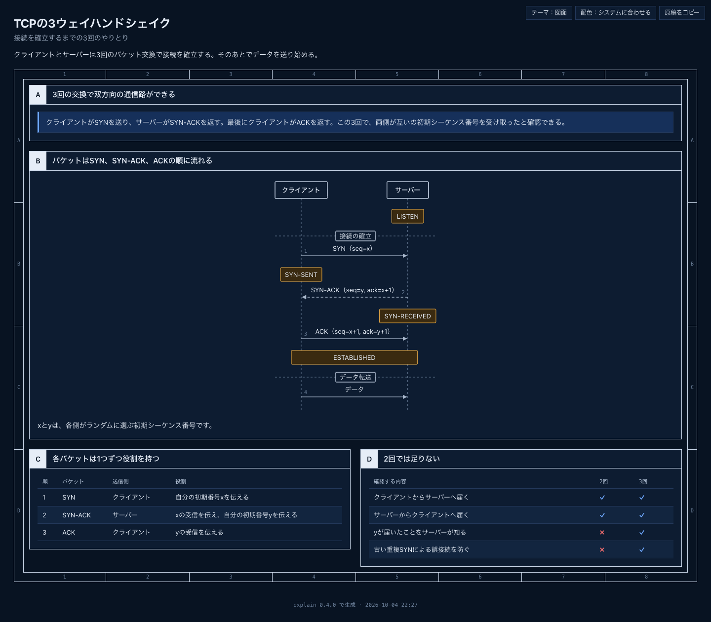
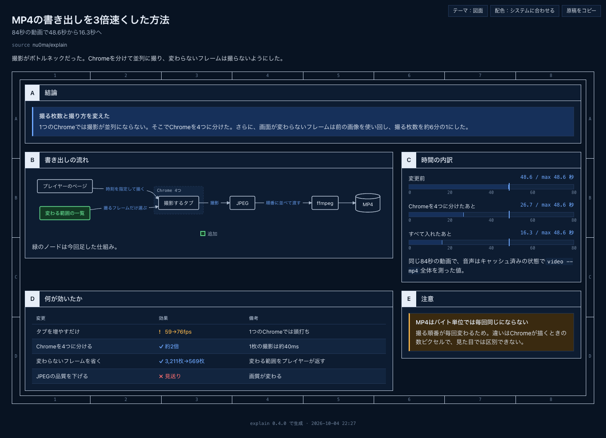
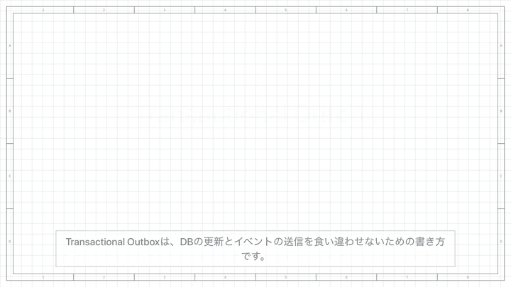
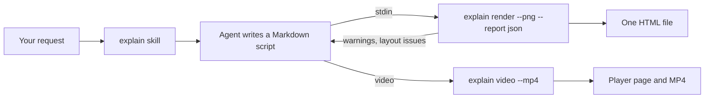

<div align="center">

# explain

Instant explainer pages and narrated videos for Claude Code.<br>
Say 「図にして」 and get a diagram. Say 「動画で説明して」 and get a narrated video.


<a href="docs/demo/dns-resolution.video.mp4"></a>

<sub>2x speed, no audio. Click for the MP4 with narration.</sub>

</div>

## Quick start

1. Install, inside a Claude Code session:

   ```
   /plugin marketplace add nu0ma/explain
   /plugin install explain@explain
   ```

2. Ask for an explanation:

   ```
   この PR の変更前と変更後を図にして
   ```

3. The agent writes a Markdown script, renders it with the bundled CLI, fixes what the CLI reports, and gives you the path of the page.

Needs only Node 24.21+. `--png` and `--mp4` also use Chrome, MP4 export uses ffmpeg, and narration uses macOS `say`.

## Why explain

| | |
| --- | --- |
| **Instant** | A page in 0.08 s. An 84-second 1080p narrated video in 17 s. |
| **Zero dependencies** | One 177 KB file. Just Node. No API keys, no external TTS service. |
| **Agent-native** | The agent writes the script. The CLI lays it out, checks the prose, and returns a JSON report of what to fix. |
| **Self-contained output** | One HTML file per page, with no network requests. `--static` drops every `<script>`. |
| **Japanese first** | Built for one engineer who works in Japanese. Output and messages are Japanese only. |

## Gallery

<table>
<tr>
<td width="50%"><a href="docs/demo/transactional-outbox.html"></a><br><b>Transactional Outbox</b><br><sub>Before/after flow, sequence, comparison table · <a href="docs/demo/transactional-outbox.md">script</a></sub></td>
<td width="50%"><a href="docs/demo/oauth2-authorization-code.html"></a><br><b>OAuth 2.0 authorization code flow</b><br><sub>13 steps across five actors · <a href="docs/demo/oauth2-authorization-code.md">script</a></sub></td>
</tr>
<tr>
<td width="50%"><a href="docs/demo/tcp-handshake.html"></a><br><b>TCP three-way handshake</b><br><sub>Sequence with connection states · <a href="docs/demo/tcp-handshake.md">script</a></sub></td>
<td width="50%"><a href="docs/demo/mp4-export-speedup.html"></a><br><b>How MP4 export got 3x faster</b><br><sub>Pipeline flow, measured times, what helped · <a href="docs/demo/mp4-export-speedup.md">script</a></sub></td>
</tr>
<tr>
<td width="50%"><a href="docs/demo/transactional-outbox.video.mp4"></a><br><b>Video: Transactional Outbox</b><br><sub>Click for the MP4 · <a href="docs/demo/transactional-outbox.video.md">script</a></sub></td>
<td width="50%"><a href="docs/demo/dns-resolution.video.mp4"></a><br><b>Video: DNS name resolution</b><br><sub>Click for the MP4 · <a href="docs/demo/dns-resolution.video.md">script</a></sub></td>
</tr>
</table>

## Commands

| Command | |
| --- | --- |
| `/explain <what to explain>` | Explain something as a page, or as a video when you ask for one |
| `/explain:config` | Show the settings and change one |
| `/explain:config set <key> <value>` | Change a setting, for example `open off` |
| `/explain:cache` | Show the narration cache |
| `/explain:cache clear` | Clear the narration cache, after confirming |

You do not need the command: asking 「図にして」, 「HTML で説明して」, or 「動画で説明して」 loads the skill too.

## Components

| Shape of the information | Component |
| --- | --- |
| What connects to what, architecture, decision branches | `flow` |
| Messages between actors over time | `sequence` |
| Hierarchy, directories, taxonomy | `tree` |
| History, phases | `timeline` |
| Values against a limit | `limits` |
| Comments on parts of one sentence | `annot` |
| Metadata, a title block | `kv` |
| Conclusion, warning | `callout` |
| Comparison across dimensions | Markdown table with `ok` / `no` / `warn` |

Diagrams lay out automatically: you write only the relationships. `explain help <component>` shows the syntax and when to use each one.

## How it works

<details>
<summary>From your request to the page</summary>



- Turns a PR's before and after, the flow of an incident, or a system's architecture into a one-page diagram.
- Lays out diagrams (flow / sequence / tree, etc.) automatically: you only write the relationships.
- Checks the prose in your script against Japanese STE rules (sentence length, redundant phrasing, hedging, etc.), and against every rule of the [yomiyasu](https://github.com/nanaism/yomiyasu) checker for AI-style Japanese (buzzwords, metaphorical verbs, fillers, 「AではなくB」, emoji, half-width spaces around English words, trailing colons, repeated sentence endings, excessive bold or lists, and `**` that does not render as bold). `explain lint` also prints yomiyasu's 0–100 score.
- With `--static`, emits HTML without any `<script>`, for hosts that forbid JavaScript.

</details>

## Speed

<details>
<summary>Measured times and why</summary>

Measured on an Apple M3 Max with Node 24.21, Chrome 154, ffmpeg 8.0, and macOS `say`. Each number is the median of 3 runs on the demo scripts.

| Command | Time |
|---|---|
| `explain render` (page, Transactional Outbox) | 0.08 s |
| `explain render --png` (page, screenshot, and layout check) | 0.86 s |
| `explain video` (84 s DNS video, narration cached) | 0.74 s |
| `explain video` (84 s DNS video, narration synthesized) | 6.6 s |
| `explain video --mp4` (84 s, 1920×1080, 30 fps, narration cached) | 17 s |

- Parsing, layout, and the prose check run in one Node process with no runtime dependencies. The Markdown renderer and the flow layout are written in this repository, and the CLI ships as one file of about 177 KB.
- MP4 export screenshots only the frames that change. The player reports when each scene, step, camera move, and caption changes, and every other frame reuses the previous image. The frames are spread over several headless Chrome processes, because one Chrome takes about 40 ms per screenshot however many tabs it has.
- Narration is cached per sentence and voice, so re-rendering a video only synthesizes the lines that changed.
- The skill has the agent fix a video script with `explain lint` (under 0.1 s) before it renders the video once.

</details>

## Use the CLI directly

<details>
<summary>Install the CLI and its commands</summary>

```sh
pnpm install
pnpm add --global "$PWD"      # installs the explain command (or run node bin/explain.ts)

explain render script.md                            # build an explainer page and open it in the browser
explain render script.md --static                   # build HTML without <script>
explain render script.md --watch                    # serve the page and rebuild/reload on every save
explain render script.md --png                      # also save a full-page PNG and report layout problems (needs Chrome)
explain render script.md --png --report json        # print the result as JSON, for AI agents
explain lint   script.md                            # run the STE check only
explain video  script.md                            # build a video player page (add --mp4 for an MP4 file)
explain help format                                 # script format
explain list                                        # list components and themes
explain config                                      # show and change settings
explain cache [clear]                               # show (or clear) the narration audio cache
```

- Output goes to `~/.explain/pages/` and `~/.explain/videos/`; settings live in `~/.explain/config.json`. Set `EXPLAIN_HOME` to change the location. If only `~/.explain-cli/` (the directory from before the rename) exists, the CLI keeps using it.
- `pnpm run build` writes `skills/explain/scripts/explain.mjs`, a single file that bundles all dependencies. It runs on its own with Node 24.21 or later. The bundle is committed so that the plugin works without `pnpm install`; rebuild it whenever `src/` changes, because CI fails when it differs from the build output. The sources are TypeScript and run directly on Node without a build step.
- Video narration is synthesized only with macOS `say`, using a Japanese voice (Kyoko, Eddy, Flo, or Reed, in that order). No external TTS service or API key is used. On other platforms, use `--voice off` for a subtitles-only video.
- `--png` and `--mp4` use the installed Chrome, Chromium, Edge, or Brave. Set `EXPLAIN_CHROME` to use another binary. Pointing it to `chrome-headless-shell` (for example, from `npx @puppeteer/browsers install chrome-headless-shell@stable` or the Playwright cache) cuts the browser launch from about 0.5 s to about 0.1 s, which makes `--png` noticeably faster. The CLI does not pick the headless shell on its own: its version can differ from the installed Chrome, and layout checks and images can then differ by a few pixels.

</details>

## Stable flow node IDs

<details>
<summary>Give two nodes the same label, or keep a node across video scenes</summary>

Existing flow syntax still uses the label as the node ID (`A -> B`, `(Start)`, `[API]`). To give two nodes the same label, or rename a node between video scenes, declare an explicit ID before its shape brackets:

```flow LR
@api1[API] -> @api2[API]
api1 -> @db[(Database)]
group Backend: api2, db
```

Use `@id[Label]`, `@id(Label)`, `@id{Label}`, or `@id[(Label)]`. The ID starts with an ASCII letter or underscore and contains only ASCII letters, digits, underscores, hyphens, or dots. Put diff/highlight marks before the declaration, for example `+*@api1[API]`. References use the ID without `@`, including group members. A reference may precede its declaration. Within a diagram, the last explicit declaration supplies the label; bare references do not reset it.

In consecutive video scenes, `@api[Old API]` and `@api[New API]` share the same animation identity. Narration can target the ID with `[api]`. Declare the label in each diagram. Video animation and focus use IDs across the whole scene, so use distinct IDs for nodes in separate diagrams within one scene. IDs are case-sensitive; camera focus tries an exact ID before its existing fuzzy label matching. Different IDs remain different nodes even when their labels match. To show the new declaration syntax literally as a label, wrap it in a different pair of shape brackets, for example `(@api[API])`.

</details>

## Rewriting AI-style Japanese

<details>
<summary>Use the yomiyasu skill to rewrite a script</summary>

`explain lint` only points out AI-style phrasing; it does not rewrite your script. To rewrite a script drafted by an AI agent before running `explain render`, use the [yomiyasu](https://github.com/nanaism/yomiyasu) Agent Skill. It is declared in `apm.yml` (pinned to v1.0.5), so [APM](https://github.com/microsoft/apm) deploys it to `.claude/skills/`:

```sh
apm install --frozen
```

Then ask your agent to apply yomiyasu to the script, and run `explain lint` again to confirm the warnings are gone. Findings marked `（参考）` are yomiyasu's `info` level and do not block `style: strict`.

</details>

## Development

<details>
<summary>Build, test, and evaluate the prompt</summary>

```sh
pnpm install
pnpm test                        # unit tests; EXPLAIN_E2E=1 also runs the Chrome tests
pnpm run build                   # rebuild skills/explain/scripts/explain.mjs and commit it
claude plugin validate .
```

### Evaluating the prompt

What the reader gets out of a page depends mostly on the script the agent writes, so `skills/explain/SKILL.md`, `commands/*.md`, and the CLI help text (`explain help format`, `explain help video`, `explain help <component>`) are the prompt. After changing any of them, run the eval suite in `evals/` and compare the scores with the previous run:

```sh
claude plugin eval . --judge-model sonnet --allow-tools 'Bash(node:*)' Write   # all cases, with the no-plugin baseline
claude plugin eval . --judge-model sonnet --allow-tools 'Bash(node:*)' Write --tag quality   # a subset: quality, trigger, quiet, args, video
```

- Cases in `quality` grade the script the agent wrote; `trigger` and `quiet` check that the skill loads only when it should; `args` checks `/explain config`.
- The default judge (haiku) fails good video scripts too often, so pass `--judge-model sonnet`.
- The eval sandbox cannot start Chrome or macOS `say`, so `--png` falls back to no image and videos get subtitles only. The graders read the script and the CLI report, not the images.

Each case runs 3 times with the plugin and 3 times without it by default, and every run uses model credit, so the suite runs locally and not in CI.

</details>

## License

[MIT](LICENSE)
